<!-- Generated from profile.json by scripts/generate_readme.py. Edit the config, not this file. -->

  

<b>AI • AUTOMATION • ACCOUNTING SYSTEMS</b>

Building intelligent systems where AI, automation and accounting operations meet.

I work with accounting operations and build software and AI systems around real-world business workflows.

  

  

### Systems in progress

- **ELVARC** · in development — An AI, software and automation ecosystem. Enterprise • Leadership • Ventures • Architecture • Research • Computing.

- **FORGE** · experimental — An experimental AI chatbot and multi-agent platform exploring an AI gateway, model adapters, Gemini and Anthropic Claude integrations, and AI orchestration.

- **AccuTax** · building — GST reconciliation across Tally and GST portal data: GSTR-1, GSTR-2B and GSTR-3B; monthly and aggregate reconciliation; taxable value, total value, CGST, SGST and IGST difference analysis.

- **AI Review Platform** · developing — A developing AI-powered accounting review platform to analyse operations, identify issues and centralize findings. Long-term direction: client-specific AI agents reporting into one central system.

### Accounting automation

Tally automation · Zoho Books · GST reconciliation · Bank reconciliation · Financial statement preparation · Data processing · Accounting workflow automation · AI-assisted accounting review · n8n automation · API integrations.

### Engineering

Repository-backed tools: **React · TypeScript · Node.js · Gemini API**.

Profile tooling: **Python · SVG · GitHub Actions**. Self-contained assets, reproducible builds, daily activity refresh.

  

Activity comes from [@Surge197](https://github.com/Surge197)’s public GitHub calendar and is refreshed daily. It reflects what GitHub makes visible, not a claim of project deployment or a productivity score.

Static / reduced-motion version and profile architecture

Animations honor reduced-motion preferences in supporting browsers. Fully static alternatives:

[Identity](./assets/static/hero.svg) · [Focus](./assets/static/info-card.svg) · [Projects](./assets/static/projects.svg) · [Activity](./assets/static/contribution-heatmap.svg)

[How this profile works](./docs/DEVELOPMENT.md) · [Research and accuracy notes](./docs/REFERENCE.md)

